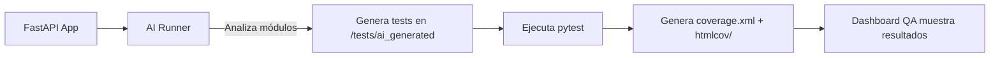

# 🧠 DataSync QA Adapter – Sincronización y QA Inteligente con IA + FastAPI

[](https://github.com/MRochin/Reto3_InteligenciaArtificial/actions/workflows/qa.yml)
[](https://github.com/MRochin/Reto3_InteligenciaArtificial/actions/workflows/codeql.yml)
[](https://github.com/MRochin/Reto3_InteligenciaArtificial/actions/workflows/docker-publish.yml)

---

## 🧩 Descripción general

**DataSync QA Adapter** es un servicio **FastAPI** diseñado para sincronizar datos entre **SQL Server** y **MySQL** con seguridad, trazabilidad y aseguramiento de calidad automatizado.  
Integra autenticación **JWT**, validaciones **Pydantic**, **Rate Limiting**, y un modo **Mock** para pruebas sin conexión a base de datos real.

La gran innovación del proyecto es su **Dashboard QA Inteligente**, que permite:
- Ejecutar pruebas unitarias con o sin IA desde el navegador.
- Visualizar en tiempo real el **log de ejecución (streaming)**.
- Generar y evaluar automáticamente casos de prueba con **IA generativa**.
- Consultar cobertura de código actualizada y navegar el reporte HTML.

---

## 🚀 Despliegue con Docker / Docker Compose

### 🧱 Opción A – Docker Compose (recomendada)
1. Copia `.env.example` a `.env` y ajusta tus variables:
   ```bash
   cp .env.example .env
   ```
2. Levanta el servicio:
   ```bash
   docker compose up --build -d
   ```
3. Verifica el estado:
   ```bash
   curl http://localhost:8000/health
   ```

📦 Por defecto:
- El adaptador se expone en `http://localhost:8000`.
- El dashboard QA está disponible en [`http://localhost:8000/qa`](http://localhost:8000/qa).
- El DataSync host se monta en `/app/datasync` (solo lectura, configurable).

---

## 🧪 QA Dashboard Inteligente

Al iniciar el contenedor, visita:  
👉 **[http://localhost:8000/qa](http://localhost:8000/qa)**

### Funcionalidades principales
| Botón | Descripción |
|--------|--------------|
| 🤖 **Forzar IA** | Ejecuta `tools/ai_test_runner.py` usando `python -m tools.ai_test_runner`. Genera pruebas automáticamente mediante IA y ejecuta el coverage. |
| 🐍 **Forzar pytest** | Ejecuta las pruebas normales (`pytest --cov=app --cov-report=html --cov-report=xml -q`). |
| 📡 **Stream en vivo** | Muestra la salida de las pruebas en tiempo real dentro del navegador. |

El dashboard también muestra:
- **Porcentaje de cobertura** (automático al cargar la página o al finalizar las pruebas).
- **Indicadores visuales de calidad:** verde ≥80%, amarillo 60–79%, rojo <60%.
- Enlace directo al reporte HTML de cobertura (`/htmlcov`).

---

## ⚙️ Endpoints QA

| Endpoint | Descripción |
|-----------|-------------|
| `/qa/run-tests` | Ejecuta pruebas (`mode=ai`, `pytest` o `auto`). |
| `/qa/run-tests/stream` | Ejecuta pruebas con salida en vivo (streaming). |
| `/qa/coverage/summary` | Devuelve cobertura actual (JSON). |
| `/qa/coverage/refresh` | Remonta `/htmlcov` si fue regenerado. |
| `/qa/ai-runner` | Verifica si existe y dónde se encuentra `ai_test_runner.py`. |
| `/internal/dev-token` | Genera token JWT de desarrollo (solo modo local). |

---

## 🧠 Generación Automática de Pruebas con IA

El archivo `tools/ai_test_runner.py` permite generar **tests unitarios inteligentes** usando modelos de lenguaje (ej. GPT-4, o local).  
El sistema analiza el código fuente, identifica rutas y genera automáticamente archivos bajo `/tests/ai_generated/`, que luego se ejecutan con `pytest`.

### Flujo completo:



---

## ⚙️ Estructura del proyecto

```
📦 DataSync QA Adapter
├── app/
│   ├── main.py              → Entrypoint principal (incluye dashboard QA)
│   ├── auth.py              → JWT + autenticación
│   ├── schemas.py           → Validaciones Pydantic
│   └── settings.py          → Configuración + Rate Limiting
│
├── tools/
│   └── ai_test_runner.py    → Generador automático de pruebas con IA
│
├── tests/
│   ├── ai_generated/        → Tests creados por IA
│   └── test_edgecases.py    → Pruebas de fallback y seguridad
│
├── datasync-mock/src/       → Motor de sincronización simulado
│   └── sync_engine.py
│
├── htmlcov/                 → Reportes de cobertura HTML
├── docker-compose.yml
├── Dockerfile
├── pytest.ini
├── .coveragerc
├── prompts/                 → Prompts base del AI runner
└── README.md
```

---

## 🔐 Seguridad y CI/CD

El proyecto integra pipelines de aseguramiento de calidad con análisis estático, dinámico y de dependencias:

| Fase | Herramienta | Propósito |
|------|--------------|-----------|
| Estilo y lint | Ruff | Validación PEP8 y convenciones |
| Seguridad estática | Bandit | Análisis de vulnerabilidades |
| Secret scanning | Detect-Secrets | Detección de claves o tokens expuestos |
| Auditoría | Pip-Audit | Dependencias con CVE |
| Análisis semántico | CodeQL | Vulnerabilidades de flujo y lógica |
| Imagen Docker | Trivy | Escaneo de CVE críticos |
| Pruebas | Pytest + Coverage | Garantiza calidad ≥80% |
| Automatización | GitHub Actions | CI/CD y despliegue a GHCR |

---

## 🧪 Comandos útiles

| Acción | Comando |
|--------|----------|
| 🧪 Ejecutar pruebas | `pytest --cov=app --cov-report=term-missing` |
| 🤖 Ejecutar AI Runner | `python -m tools.ai_test_runner` |
| 📈 Ver cobertura | `open htmlcov/index.html` |
| 🐳 Levantar entorno Docker | `docker compose up --build -d` |
| 🔧 Revisar endpoints QA | `curl -X GET http://localhost:8000/qa/ai-runner` |

---

## 🧠 Inteligencia Artificial aplicada a QA

El sistema combina **IA generativa + QA automatizado** para crear un entorno de validación continua:
- **Generación dinámica de tests** con comprensión semántica del código.
- **Aprendizaje incremental**: la IA analiza los resultados de cobertura y mejora los casos faltantes.
- **Pipeline auto-verificante**: si el coverage baja <80%, la IA propone y genera nuevos tests.
- **Auditoría predictiva** con CodeQL y Trivy integrados.

---

## 🧑‍💻 Autor y mantenimiento

**Desarrollado por:** [MRochin](https://github.com/MRochin)  
**Repositorio:** [Reto3_InteligenciaArtificial](https://github.com/MRochin/Reto3_InteligenciaArtificial)  
**Licencia:** MIT  
**Última actualización:** Octubre 2025

---

> ✨ “La mejor prueba no es solo la que pasa, sino la que enseña por qué el código fallaría.” — *QA Philosophy*
